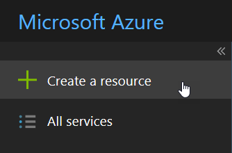
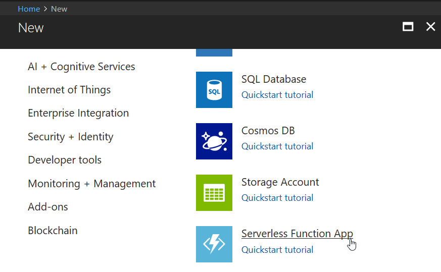
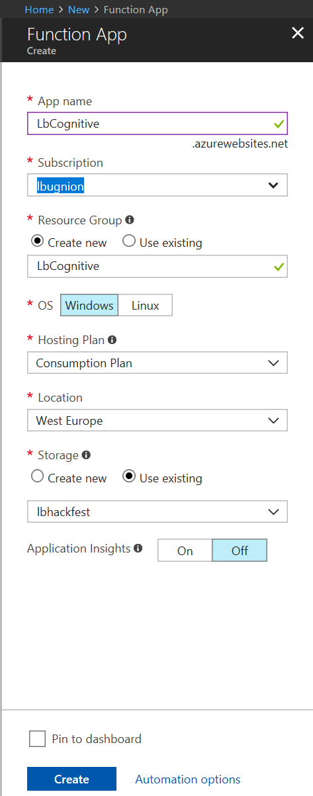

# Creating the function application in the portal

1. Navigate to [portal.azure.com](http://portal.azure.com).

2. Click on Create a resource.

3. In the Azure Marketplace, select Serverless Function App (or Function App).

4. Fill the information.
- App Name: Any unique name (in this sample I use LbCognitive).
- Subscription: The Azure subscription to which this resource will be associated.
- Resource group: You can either use an existing Resource group, or create one for this application. It's just a logical way to group and manage resources used for an Azure application.
- OS: You can choose between Windows and Linux
- Hosting plan: You can start with a Consumption plan, where your function will only be billed when it is used. Later if usage is growing, you can select an App service plan instead.
- Location: Select a data center close to your users.
- Storage: Create a new storage account where the blob containers will be placed, or select an existing one. It makes sense for the storage account to be in the same region as the function itself.
- Applicationj Insights: Turn this on if you want to use additional analytics on your function's usage.

5. Click on Create.

## Creating and configuring the function

You can see two examples here:

- [Smart creation of a thumbnail using Azure Cognitive Services](./Doc/thumbnail.md)

- [Handwritten text recognition using Azure Cognitive Services](./Doc/text-recognition.md)