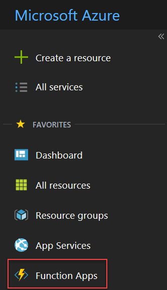
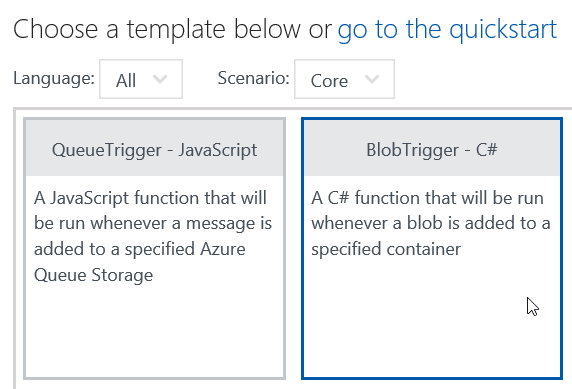
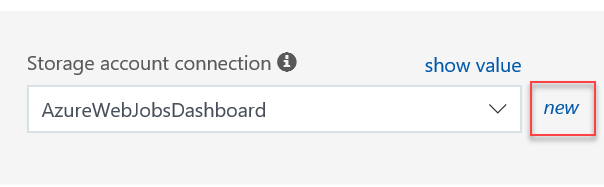

# Handwritten text recognition using Azure Cognitive Services

> Note: Before you go on, did you check [
Creating the function application in the portal](./creating.md) ?

This sample shows how to create a blob triggered Azure function in the Azure portal, configure it for input/output, and implement code using Azure cognitive services to **recognize handwritten text in an image**.

The artificial intelligence analyzes the image and creates a JSON file with the words that were recognized as well as positional information about the words in the image.

This article assumes that you already have an Azure subscription. If you don't, [you can get one for free](https://github.com/lbugnion/sample-azure-general/blob/master/Doc/trial-account.md).

## Configuring the blob containers

In this section, we will use the Microsoft Azure Storage Explorer to configure the blob containers. This is very easy.

1. Open the Microsoft Azure Storage Explorer. You can get more information [about how to install this tool here](https://github.com/lbugnion/sample-azure-general/blob/master/Doc/azure-explorer.md).

2. Expand the subscription under which you want to work.

3. Expand the Blob containers node.

4. Right click on Blob containers and select Create Blob Container


5. Enter a name for the new input blob container, for example ```images-text```.

6. Repeat the steps to create another blob container for the output, for example ```images-text-out```.

You're done! Remember the names ```images-text``` and ```images-text-out``` because you will need them when you create the functions.

## Creating the blob triggered function

After you [created the function application](./creating.md), you can now create the blog triggered function itself with the following steps:

1. Navigate to the function application that you just created. This is available by selecting the Function Apps menu on the left hand side.



2. Select the function app that you just created and click on the + sign to create a new function.


3. Click on "Custom function" under "Get Started on your own"


4. Scroll down to Blob Trigger with C# and click.



5. Enter a name for your function, for example ```ExtractText```

6. Enter the path of the Azure blob storage container. This is only for the trigger, aka the "input blob". We will configure the output blob later. In our case, we use ```images-text/{name}```. Note that the ```{name}``` parameter will be the name of the file that you upload, which can be useful in the function.


7. Next to the "Storage account connection" combo box, click on New



8. In the blade opening on the right, select the Storage account that you want to use. This is the same storage account that we configured earlier in the "Configuring the blob containers" section.


9. Once everything is ready, click on the Create button.

Now we will configure the output blob container. We can do this at any time from the function's portal.

10. Click on the Integrate menu in the function's tree. In this menu you can see the properties that you entered earlier for the input blob.


11. Click on New Output


12. Select Azure Blob Storage from the choice then click Select.


13. If needed, you can change the name of the output blob parameter. This is what you will use in the Function to write to the Stream.

14. Change the path of the output container. In our sample we use ```images-text-out/{name}.txt```. Note that we added a ```.txt``` extension because the resulting file will be a text file containing some JSON.

15. Under Storage account connection, select the same connection than you selected for the input blob. Then click the Save button.


## Implementing the Function

Now we are ready to code the function. First we will quickly test to see if everything is configured propoerly.

1. Click on the ```ExtractText``` function name. You should now see the code editor on the right hand side.

2. Replace the content of the code editor with the following code. Note that we use an asynchronous signature because we will use the await keyword later for the full implementation.

```CS
public static async Task Run(
    Stream myBlob, 
    string name, 
    Stream outputBlob, 
    TraceWriter log)
{
    using (var writer = new StreamWriter(outputBlob))
    {
        writer.Write($"Found blob {name} with {myBlob.Length} bytes");
    }
}
```

3. Press the Save button in the code editor. Check the Logs area, it should show that the code was compiled without errors (after a few seconds).

4. Move to the Azure Storage Explorer and select the Upload button in the toolbar.


5. In the Upload files dialog, press the `...` and select an image file. Then press on the Upload button.


6. In the Azure Portal window, check the logs again. After a short wait, you should see the log messages showing up as shown below


7. Open the Azure Storage Explorer and navigate to the ```images-text-out``` blob container.

8. Find the file with the same name as the image you just uploaded, and the ```txt``` extension. You can double click this file to open it and you should see text corresponding to our code here above.

## Getting the cognitive service API key and URL

In order to call the Azure cognitive services, we will need a key and a URL. All the Azure services are exposed through REST URLs which are really easy to call. However we need a little bit of setup first. 

1. Go to the Cognitive services homepage at [https://azure.microsoft.com/en-us/services/cognitive-services](https://azure.microsoft.com/en-us/services/cognitive-services).

2. Click on the "Try Cognitive Services for free" button.

[](https://azure.microsoft.com/en-us/try/cognitive-services)

3. Under "Computer Vision API", click the "Get API Key" button.

4. Agree to the terms and services, and select your region. Then click on Next

5. Sign into the service. You can use a Microsoft Account (MSA), LinkedIn, Facebook or Github.

6. After you are authenticated, copy the Key 1. You won't need the second API key here.

7. Also copy the Endpoint URL.

> Note: In your code, you must add the ```recognizeText``` API name to [YOUR ENDPOINT URL]. For example a valid endpoint URL could be ```https://westcentralus.api.cognitive.microsoft.com/vision/v1.0/recognizeText```


The two values that you just copied will be used in the function implementation below.

## Implementing the final code

Now is the time to implement the code creating the smart thumbnail. You can see the full function code below in the "Full code" section. Follow the steps:

1. First, we will define a few constants. Replace the content of the ```Run``` method with the following attributes:

```CS
string _apiKey = "[YOUR API KEY]";
string _apiUrlBase = "[YOUR ENDPOINT URL]";
```

2. In the code, replace ```[YOUR API KEY]``` with the key that you obtained in the previous section. Also replace ```[YOUR ENDPOINT URL]``` with the URL of the service corresponding to the key. Remember that you must add the API name ```recognizeText``` to the endpoint URL that you copied from the cognitive services dashboard.

> Note: You need to use the URL of the service corresponding to the key that you obtained in the previous section. Other keys or URLs won't work.

3. Add the following code creating and initializing the HTTP Client that we will use to call the cognitive services. Note how the API key is set in the header of the HTTP client.

```CS
using (var httpClient = new HttpClient())
{
    httpClient.BaseAddress = new Uri(_apiUrlBase);
    httpClient.DefaultRequestHeaders.Add("Ocp-Apim-Subscription-Key", _apiKey);

    // CONTINUE HERE
}
```

4. In the same ```using``` block, where the comment ```CONTINUE HERE``` stands, add the following code. This creates a ```StreamContent``` that we will POST to the cognitive service. Notice that we appended ```handwriting=true``` to give an indication to the cognitive service that the text is handwritten. You can change this to ```false``` if you want to perform recognition on non-handwritten text.

```CS
using (HttpContent content = new StreamContent(myBlob))
{
    //get response
    content.Headers.ContentType = new System.Net.Http.Headers.MediaTypeWithQualityHeaderValue("application/octet-stream");
    var uri = $"{_apiUrlBase}?handwriting=true";
    var response = httpClient.PostAsync(uri, content).Result;

    // CONTINUE HERE
}
```
5. The service is not executed immediately, but instead it returns a URL in a variable called ```Operation-Location``` which we need to read now. Replace the ```CONTINUE HERE``` comment with the following code:

```CS
string operationLocation = null;

// The response contains the URI to retrieve the result of the process.
if (response.IsSuccessStatusCode)
{
    operationLocation = response.Headers.GetValues("Operation-Location").FirstOrDefault();
}
else
{
    log.Error("Operation failed");
    return;
}
```

6. Now we will ping the URL returned in the ```Operation-Location``` variable until we get a result. This is not a very friendly way to do things but thankfully the fact that we can run the Function asynchronously allows us to do this anyway:

```CS
string contentString;
int i = 0;
do
{
    System.Threading.Thread.Sleep(1000);
    response = await httpClient.GetAsync(operationLocation);
    contentString = await response.Content.ReadAsStringAsync();
    ++i;
}
while (i < 10 && contentString.IndexOf("\"status\":\"Succeeded\"") == -1);

if (i == 10 && contentString.IndexOf("\"status\":\"Succeeded\"") == -1)
{
    log.Error("\nTimeout error.\n");
    return;
}
```

7. As the last operation, we use a StreamWriter to write the content of the resulting JSON file to the outputBlob Stream. Because we configured this Stream to end up in the output blob container, the write operation will save everything in Azure.

```CS
using (var writer = new StreamWriter(outputBlob))
{
    writer.Write(contentString);
}
```

## Testing the function

Now we can test the function. To do this, start the [Azure Storage Explorer](https://github.com/lbugnion/sample-azure-general/blob/master/Doc/azure-explorer.md). Then follow the steps:

1. Navigate to the blob container that you created earlier: ```images-text```.

2. Upload a picture with handwritten text like we did before. For example, here is a picture with handwritten text:


3. Observe the log section in the web portal. After a short wait, you should see that the function is executed and succeeded.

4. Using the Azure Storage Explorer, open the ```images-text-out``` blob container. You should find a new file with the same name as the image you just uploaded, and the ```txt``` extension. In our case, here is the JSON created by the artificial intelligence. We can see the recognized words as well as some information about the bounding box containing the words in the picture. This can be used for example to draw a frame around the words, etc.

```JSON
{
	"status": "Succeeded",
	"recognitionResult": {
		"lines": [{
			"boundingBox": [37,
			15,
			931,
			60,
			920,
			272,
			25,
			251],
			"text": "Hello Azure",
			"words": [{
				"boundingBox": [16,
				27,
				359,
				31,
				389,
				257,
				46,
				254],
				"text": "Hello"
			},
			{
				"boundingBox": [469,
				32,
				940,
				37,
				956,
				263,
				498,
				258],
				"text": "Azure"
			}]
		}]
	}
}
```

## Full code

Here is the full code for the function. Simply copy/paste the code below in the code window, save, check that the compilation succeeded and then upload an image file to the blob container to check if the code works. Happy coding and testing!

```CS
public static async Task Run(
    Stream myBlob, 
    string name, 
    Stream outputBlob, 
    TraceWriter log)
{
    string _apiKey = "[YOUR API KEY]";
    string _apiUrlBase = "[YOUR ENDPOINT URL]";

    using (var httpClient = new HttpClient())
    {
        httpClient.BaseAddress = new Uri(_apiUrlBase);
        httpClient.DefaultRequestHeaders.Add("Ocp-Apim-Subscription-Key", _apiKey);

        using (HttpContent content = new StreamContent(myBlob))
        {
            //get response
            content.Headers.ContentType = new System.Net.Http.Headers.MediaTypeWithQualityHeaderValue("application/octet-stream");
            var uri = $"{_apiUrlBase}?handwriting=true";
            var response = httpClient.PostAsync(uri, content).Result;

            string operationLocation = null;

            // The response contains the URI to retrieve the result of the process.
            if (response.IsSuccessStatusCode)
            {
                operationLocation = response.Headers.GetValues("Operation-Location").FirstOrDefault();
            }
            else
            {
                log.Error("Operation failed");
                return;
            }

            string contentString;
            int i = 0;
            do
            {
                System.Threading.Thread.Sleep(1000);
                response = await httpClient.GetAsync(operationLocation);
                contentString = await response.Content.ReadAsStringAsync();
                ++i;
            }
            while (i < 10 && contentString.IndexOf("\"status\":\"Succeeded\"") == -1);

            if (i == 10 && contentString.IndexOf("\"status\":\"Succeeded\"") == -1)
            {
                log.Error("\nTimeout error.\n");
                return;
            }

            using (var writer = new StreamWriter(outputBlob))
            {
                writer.Write(contentString);
            }
       }
    }
}
```
