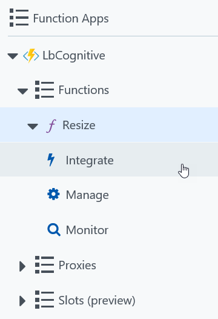

# Smart creation of a thumbnail using Azure Cognitive Services

This sample shows how to create a blob triggered Azure function in the Azure portal, configure it for input/output, and implement code using Azure cognitive services to create smart thumbnails.

The artificial intelligence analyzes the image and create a cropped version that makes sure that relevant information is displayed.

This article assumes that you already have an Azure subscription. If you don't, [you can one for free](https://github.com/lbugnion/sample-azure-general/blob/master/Doc/trial-account.md).

## Configuring the blob containers

In this section, we will use the Microsoft Azure Storage Explorer to configure the blob containers. This is very easy.

1. Open the Microsoft Azure Storage Explorer. You can get more information [about how to install this tool here](https://github.com/lbugnion/sample-azure-general/blob/master/Doc/azure-explorer.md).

2. Expand the subscription under which you want to work.

3. Expand the Blob containers node.

4. Right click on Blob containers and select Create Blob Cotainer


5. Enter a name for the new input blob container, for example ```images-original```.

6. Repeat the steps to create another blob container for the output, for example ```images-thumbs```.

You're done! Remember the names ```images-original``` and ```images-thumbs``` because you will need them when you create the functions.

## Creating the blob triggered function

After you [created the function application](./creating.md), you can now create the blog triggered function itself with the following steps:

1. Navigate to the function application that you just created. This is available by selecting the Function Apps menu on the left hand side.


2. Select the function app that you just created and click on the + sign to create a new function.


3. Click on "Custom function" under "Get Started on your own"


4. Scroll down to Blob Trigger with C# and click.


5. Enter a name for your function, for example ```Resize```

6. Enter the path of the Azure blob storage container. This is only for the trigger, aka the "input blob". We will configure the output blob later. In our case, we use ```images-original/{name}```. Note that the ```{name}``` parameter will be the name of the file that you upload, which can be useful in the function.


7. Next to the "Storage account connection" combo box, click on New


8. In the blade opening, select the Storage account that you want to use. This is the same storage account that we configured earlier in the "Configuring the blob containers" section.

9. Once everything is ready, click on the Create button.

Now we will configure the output blob container. We can do this at any time from the function's portal.

10. Click on the Integrate menu in the function's tree. In this menu you can see the properties that you entered earlier for the input blob.



11. Click on New Output


12. Select Azure Blob Storage from the choice then click Select.


13. If needed, you can change the name of the output blob parameter. This is what you will use in the Function to write to the Stream.

14. Change the path of the output container. In our sample we use ```images-thumbs/{name}```

15. Under Storage account connection, select the same connection than you selected for the input blob. Then click the Save button.


## Implementing the Function

Now we are ready to code the function. First we will quickly test to see if everything is configured propoerly.

1. Click on the ```Resize``` function name. You should now see the code editor on the right hand side.

2. Replace the content of the code editor with the following code:

```CS
public static void Run(
    Stream myBlob, 
    string name, 
    Stream outputBlob, 
    TraceWriter log)
{
    log.Info($"Processed blob\n Name:{name} \n Size: {myBlob.Length} Bytes");
    myBlob.CopyTo(outputBlob);
    log.Info($"Copied to output. Size: {outputBlob.Length} Bytes");
}
```

## Code sample 1: Smart thumbnail with Blob Trigger

```CS
public static async Task Run(
    Stream inBlob,
    Stream outBlob, 
    TraceWriter log)
{
    int width = 320;
    int height = 320;
    bool smartCropping = true;
    string _apiKey = "22b1286a2f414d3b80bcb7a0e59c9206";
    string _apiUrlBase = "https://westcentralus.api.cognitive.microsoft.com/vision/v1.0/generateThumbnail";

    using (var httpClient = new HttpClient())
    {
        httpClient.BaseAddress = new Uri(_apiUrlBase);
        httpClient.DefaultRequestHeaders.Add("Ocp-Apim-Subscription-Key", _apiKey);
        using (HttpContent content = new StreamContent(inBlob))
        {
            //get response
            content.Headers.ContentType = new System.Net.Http.Headers.MediaTypeWithQualityHeaderValue("application/octet-stream");
            var uri = $"{_apiUrlBase}?width={width}&height={height}&smartCropping={smartCropping.ToString()}";
            var response = httpClient.PostAsync(uri, content).Result;
            var responseBytes = response.Content.ReadAsByteArrayAsync().Result;

            //write to output thumb
            outBlob.Write(responseBytes, 0, responseBytes.Length);
        }
    }
}
```
